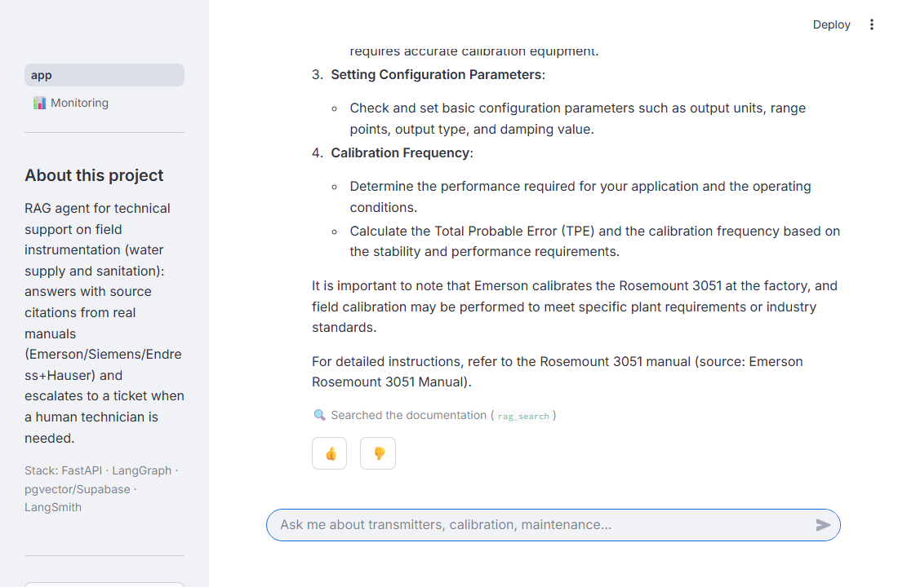
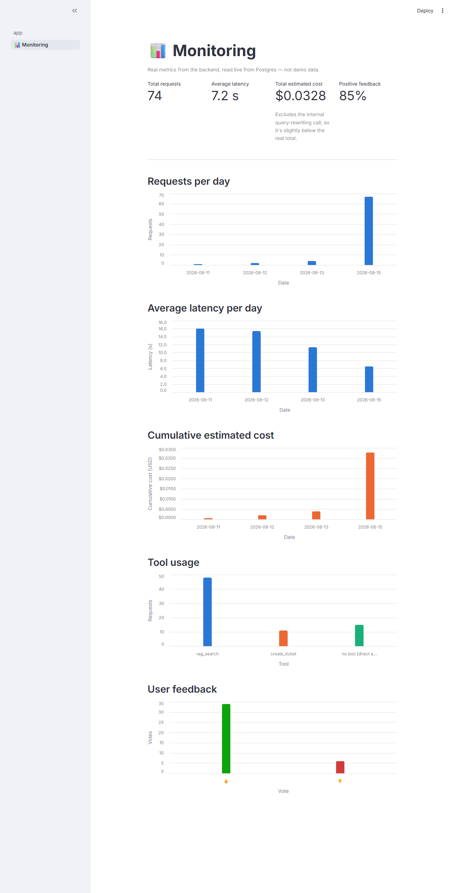

# agentic-rag-fastapi

[](https://github.com/juanbelbey/agentic-rag-fastapi/actions/workflows/ci.yml)
[](LICENSE)
[](https://www.python.org/downloads/release/python-3120/)

Technical support agent with real RAG (LangGraph + FastAPI + Postgres/pgvector) over field instrumentation manuals.

🔗 **Live demo:** [agentic-rag-fastapi.streamlit.app](https://agentic-rag-fastapi.streamlit.app/) — ask it a real question about pressure/flow/temperature transmitters. Backend runs on Render's free tier, so the first request after a period of inactivity can take up to ~30s to wake up.

## Table of contents

- [🎯 Use case](#use-case)
- [⚙️ How it works](#how-it-works)
- [📚 Technical documentation: where it comes from](#technical-documentation)
- [🚀 How to run it](#how-to-run-it)
- [✅ Evaluation criteria (LLM Zoomcamp 2026)](#evaluation-criteria)

<a id="use-case"></a>

## 🎯 Use case

Assistant for operators and technicians at municipal water and sanitation utilities (water treatment plants, distribution networks, wastewater treatment plants): answers questions about field instrumentation (pressure, flow, and temperature transmitters from Emerson/Rosemount, Siemens Sitrans, and Endress+Hauser) — calibration, error codes, measurement ranges, maintenance — citing the source manual, and creates a ticket when a query isn't covered by the documentation or needs to be escalated to human support.

Domain chosen from real experience: 2 years as a technical consultant in water supply and sanitation (water treatment plants, distribution networks, wastewater treatment for the Municipality of Monte Vera) — not a generic demo.

<a id="how-it-works"></a>

## ⚙️ How it works

- **Agent**: LangGraph (`StateGraph` with conditional routing between `agent` and `tools`)
- **Retrieval**: hybrid search (vector + Postgres full-text) fused with Reciprocal Rank Fusion, over Supabase/pgvector
- **Tools**: `rag_search` (searches the technical manuals), `create_ticket` (escalates what isn't covered)
- **API**: FastAPI, `POST /chat` endpoint

See `ROADMAP.md` for the current project status and `STACK.md` for library decisions.

<table>
<tr>
<td width="50%">

**Chat** — answers with source citation



</td>
<td width="50%">

**Monitoring dashboard** — real metrics read from Postgres



</td>
</tr>
</table>

<a id="technical-documentation"></a>

## 📚 Technical documentation: where it comes from

The corpus is 11 official manuals from Emerson/Rosemount, Siemens Sitrans, and Endress+Hauser (pressure, flow, and temperature instrumentation), downloaded from each manufacturer's official domain. They're copyrighted — not redistributed: the original PDFs are in `.gitignore`, the repo only versions the ingestion script. Source details and official links in `CORPUS_INSTRUMENTACION.MD`.

For anyone who wants to run the ingestion pipeline without downloading the real manuals, the repo also includes a **synthetic corpus** (`docs/pdfs_synthetic/`, 11 PDFs, fictional brands, same structure as the real one — see "How to run it" below and `CORPUS_INSTRUMENTACION.MD`).

<a id="how-to-run-it"></a>

## 🚀 How to run it

**Requirements to reproduce the full pipeline:**
- Python 3.12, dependencies pinned in `requirements.txt` (`pip install -r requirements.txt` installs exact versions, not ranges)
- OpenAI account with an API key (paid — the full ingestion embeds ~2451 chunks)
- Postgres with the `vector` extension enabled (Supabase free tier is enough, see `ROADMAP.md`, Capa 5B.0)
- The 11 corpus PDFs — two ways to get them:
  - **Real corpus** (what the committed evals/results were run against): not included due to copyright, but **freely downloadable without login** from each manufacturer's official domain — the 11 direct links (verified HTTP 200) and the exact filename each one expects are in `CORPUS_INSTRUMENTACION.MD`. Download them manually into `docs/pdfs/`.
  - **Synthetic corpus** (no manual step): already committed at `docs/pdfs_synthetic/` — 11 PDFs about fictional instrument brands, same structure (manufacturers/models/document types) as the real one. Lets a reviewer run the full pipeline with zero manual downloads. Content differs from the real corpus, so retrieval quality against `evals/golden_set.json` won't match the numbers reported below — that's expected, this path validates the pipeline mechanics, not the reported metrics.

```bash
python -m venv .venv
.venv/Scripts/activate  # source .venv/bin/activate on Linux/Mac
pip install -r requirements.txt
cp .env.example .env  # fill in OPENAI_API_KEY and DATABASE_URL
python -m scripts.ingest  # real corpus: requires docs/pdfs/ populated, see above
# or, no manual download needed:
INGEST_PDFS_DIR=docs/pdfs_synthetic python -m scripts.ingest
```

```bash
uvicorn src.main:app --reload
```

`POST /chat` with `{"message": "...", "thread_id": "..."}`.

Alternative with Docker (doesn't re-ingest anything, only queries the already-populated database):

```bash
docker build -t agentic-rag-fastapi .
docker run --env-file .env -p 8000:8000 agentic-rag-fastapi
```

**Reproducing the evals without paying for ingestion again:** `evals/ground_truth_retrieval.json` (520 retrieval questions) and `evals/golden_set.json` (56 generation cases, including 8 escalation-to-`create_ticket` cases) are already committed — no need to regenerate them. With a populated `chunks` table (your own or restored from a dump), `python -m evals.retrieval_metrics` and `python -m evals.run_evals` run directly against those datasets. Results from past runs are in `evals/results/YYYY-MM-DD/` for inspection without running anything.

<a id="evaluation-criteria"></a>

## ✅ Evaluation criteria (LLM Zoomcamp 2026)

This repo is the final project submission for the [LLM Zoomcamp](https://github.com/DataTalksClub/llm-zoomcamp) (DataTalks.Club). Mapping of the 9 official criteria to where each one lives in the code:

| Criterion | Where it is |
|---|---|
| 📝 Problem description | This README, "Use case" section |
| 🔎 Retrieval flow | Knowledge base (Supabase/pgvector) + LLM in the flow — hybrid search (vector + full-text) fused with RRF, `src/tools.py` (`rag_search`) |
| 📊 Retrieval evaluation | `evals/generate_ground_truth.py` + `evals/retrieval_metrics.py` — hit_rate/MRR compared across vector-only, keyword-only, and hybrid over 520 questions (`evals/ground_truth_retrieval.json`), see `ROADMAP.md`, Capa 5B.4 |
| 🧪 LLM evaluation | `evals/evaluators.py` + `evals/run_evals.py` over `evals/golden_set.json`, run in CI (`.github/workflows/ci.yml`, `evals` job); comparison of ≥2 approaches (prompt × model, 4 combinations) in `evals/compare_prompts.py`, final decision documented with data in `EXPERIMENTS.md` |
| 💬 Interface | REST API with FastAPI — `POST /chat` (`src/main.py`) |
| 📥 Ingestion pipeline | `scripts/ingest.py` — chunking + OpenAI embeddings + load into Postgres/pgvector, dedicated script (not a manual notebook) |
| 📈 Monitoring | `chat_logs` table (latency/tokens/estimated cost per request) + `GET /stats` + dashboard `streamlit_app/pages/1_📊_Monitoring.py` (4 metric tiles + 5 charts) |
| 🐳 Containerization | `docker-compose.yml` brings up backend (`Dockerfile`) + frontend (`streamlit_app/Dockerfile`) together with a single command |
| ♻️ Reproducibility | "How to run it" section above; pinned versions in `requirements.txt`; copyrighted but accessible dataset (11 direct links verified HTTP 200 in `CORPUS_INSTRUMENTACION.MD`), plus a committed synthetic corpus (`docs/pdfs_synthetic/`) for a zero-manual-steps path; reproducible evals without re-ingesting (datasets already committed) |

**Best practices:**

- ✅ **Hybrid search** — evaluated, see Retrieval evaluation above
- ✅ **Query rewriting** — `_rewrite_query_impl()` in `src/tools.py`, rewrites the query into technical English before the keyword search. Hybrid hit_rate 0.317 → 0.415 (+31%) over the 520 questions in `evals/ground_truth_retrieval.json`
- ⬜ **Re-ranking** — pending

## License

[MIT](LICENSE) — the code is free to use, modify, and distribute. The corpus PDFs are a separate matter (see "Technical documentation" above): the real manuals are copyrighted and not included in the repo.
