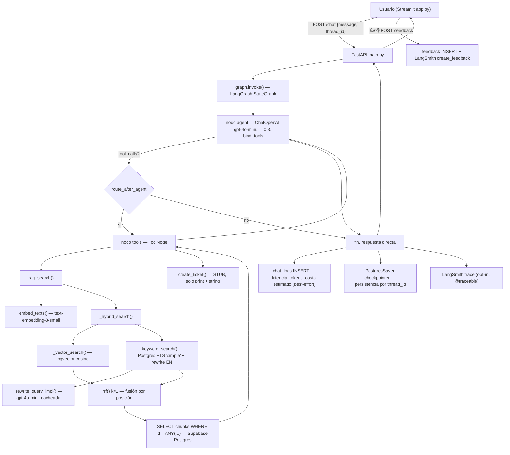

# Project Capability Audit — agentic-rag-fastapi

Auditoría técnica del repo como evidencia de capacidades reales para roles GenAI/Applied AI/AI Evaluation Engineering y para trabajo freelance. Basada en lectura de código (no de README), ejecución de tests deterministas, y verificación de resultados guardados — no es una auditoría de correctness ni un checklist de features.

**Metodología:** 10 bloques de evidencia (`auditoria/bloques.md`, no publicado — documento de trabajo interno), reclasificados en una matriz de madurez de 10 capacidades. Revisión puntual del 2026-08-31 separó dos pares de capacidades que estaban mezclando una fortaleza con una debilidad real, y corrigió dos afirmaciones que sobreprometían.

---

## Flujo real del sistema

Componentes confirmados por código: Streamlit (frontend) → FastAPI (3 endpoints, rate limiting por IP) → LangGraph `StateGraph` de 2 nodos → retrieval híbrido real (vector + keyword + RRF propio, no wrapper de LangChain) sobre Supabase/pgvector → persistencia de conversación con `PostgresSaver` → observabilidad dual (LangSmith opt-in + tablas propias `chat_logs`/`feedback`) → deploy real en Render + Streamlit Community Cloud.

---

## Matriz de madurez

Escala: `Fuerte` / `Sólida` / `Adecuada` / `Parcial` / `Débil` / `No demostrada`.

| Capacidad | Nivel | Evidencia clave | Limitación principal |
|---|---|---|---|
| **RAG & Retrieval** | Sólida | Híbrido real (vector+keyword+RRF propio), modular y testeable, decisiones medidas con datos | Sin reranker, sin metadata filtering, sin abstención ante evidencia insuficiente, sin connection pooling |
| **Retrieval Evaluation** | Sólida | Dataset de 520 preguntas ancladas a chunks reales, hit_rate/MRR con barrido de RRF documentado, comparación de estrategias con números guardados | Cobertura real ~10% del corpus, sin casos "sin respuesta", resultados históricos irreproducibles por un tercero, nada corre en CI |
| **LLM Evaluation** | Sólida | Evaluación multi-métrica y complementaria: LLM-as-judge sin referencia (`relevance`), LLM-as-judge con referencia (`accuracy`) y RAGAS (4 métricas) contra los contexts reales de la traza | Solapamiento conceptual parcial entre `relevance` y `answer_relevancy` de RAGAS; golden set sin revisión humana; evaluación continua en CI limitada a 1 caso; evaluadores sin tests propios |
| **Agent Orchestration (LangGraph)** | Sólida | Grafo `StateGraph` armado a mano, routing condicional real, persistencia `PostgresSaver` verificada contra Supabase real, parametrización que sostiene experimentación real | Campo `next_action` vestigial nunca usado; sin test unitario de routing en aislamiento |
| **Agent Reliability** | Parcial | `try/finally` cierra conexiones siempre; default de `ToolNode` evita que una tool tumbe el grafo | Sin retry/backoff ante fallos transitorios de OpenAI/Postgres; sin límite de recursión explícito; pool sin reconexión verificada |
| **Observability** | Adecuada | Dos sistemas reales y separados (LangSmith + dashboard propio con datos de negocio genuinos) | Observa el éxito, no el fallo: sin logging estructurado, sin tasa de error visible |
| **Software Engineering** | Adecuada | Módulos con responsabilidad única, bordes tipados con Pydantic, Docker razonado, dependencias ancladas con justificación | Sin lint/type-check/pre-commit automatizados, config duplicada, excepciones genéricas que exponen mensajes internos |
| **Testing Strategy** | Adecuada | 48 tests que verifican comportamientos reales (casos borde, fórmulas, límites de validación) | Componentes diferenciales (routing, evaluadores) sin test propio; 2 de 3 tests de LLM-eval nunca corren en CI |
| **Deployment** | Sólida | Deploy real y vivo (Render + Streamlit Community Cloud), Dockerfile razonado, CI con 2 jobs reales, rate limiting para exposición pública | Corre como root en el contenedor (hardening menor) |
| **Reproducibility** | Parcial | Metodología reproducible; corpus sintético comiteado permite correr la ingesta de punta a punta | Números reportados (hit_rate/MRR, RAGAS) no reproducibles por un tercero sin el corpus real (copyrighted) |

Ningún área alcanza `Fuerte` (reservado para algo sin limitaciones relevantes) ni cae en `Débil`/`No demostrada` — hay evidencia real en las 10 capacidades. El patrón: **RAG, Retrieval Evaluation, LLM Evaluation, Agent Orchestration y Deployment** llegan a `Sólida` porque tienen decisiones medidas con datos reales o verificadas contra infraestructura real; **Agent Reliability y Reproducibility** quedan en `Parcial` porque dependen casi enteramente de defaults externos (el framework, o un corpus que no se puede compartir) sin mecanismo propio que lo compense; **Observability, Software Engineering y Testing** quedan en `Adecuada` porque el diseño es correcto pero la capa de "qué pasa cuando algo falla" todavía no se construyó.

---

## Top 7 fortalezas técnicas diferenciales

| # | Fortaleza | Valor profesional | Problema empresarial que resuelve |
|---|---|---|---|
| 1 | Retrieval híbrido propio con fusión medida (vector+keyword+RRF, no wrapper de LangChain) | Demuestra que puede meterse dentro del retrieval, no solo consumirlo | "Mi RAG no encuentra lo que debería" |
| 2 | Metodología de evaluación de retrieval con datos reales (hit_rate/MRR, comparación de estrategias, barridos aislados) | Decide con números, no con intuición | "¿Este cambio de retrieval mejora o empeora antes de deployarlo?" |
| 3 | Evaluación de generación multi-métrica, con RAGAS juzgando contra los contexts reales de la traza | Diseño de QA para LLM no trivial (evita evaluar retrieval y generación con contextos distintos) | "¿Esta respuesta del LLM es confiable y grounded antes de que la vea un cliente?" |
| 4 | Orquestación de agentes con LangGraph entendida a fondo (state, routing condicional, persistencia real por thread_id) | No es "usa LangGraph", construyó el grafo a mano con criterio | "Necesito un agente que use tools condicionalmente y recuerde la conversación" |
| 5 | Observabilidad de negocio propia, independiente de terceros | Sabe la diferencia entre tracing (debugging) y monitoring (operar) | "¿Cuánto me cuesta esto en producción y quién lo usa?" |
| 6 | Experimentación disciplinada, una variable a la vez, con historial de decisiones persistido (`EXPERIMENTS.md`) | Rigor experimental transferible a cualquier stack | "Necesito saber por qué elegimos este prompt/modelo, no solo que funciona" |
| 7 | Diseño de seguridad consciente para exposición pública (rate limiting, límite de gasto, RLS, rol read-only en CI) | Piensa en abuso/costo antes de que sea un incidente | "Quiero exponer una API con mi propia key sin fundirme la cuenta" |

---

## Prioridades de mejora

**HIGH VALUE:**
1. **Evaluation reliability** — golden set sin casos "sin respuesta en el corpus", sin subset revisado a mano (el "gold" es 100% LLM-generado), sin métrica de abstención, sin regression gates mínimos en CI, y los evaluadores mismos (`extract_score`, `tool_call_evaluator`, `convergence_evaluator`) sin tests unitarios. Es la base que sostiene la credibilidad del resto.
2. **Failure observability** — logging estructurado + tasa de error visible en el dashboard. El gap más citable en una entrevista: "¿cómo sabés cuándo falla?" hoy no tiene buena respuesta.
3. **Agent reliability** — retry/backoff ante errores transitorios de OpenAI/Postgres, límite de recursión explícito y testeado.
4. **Abstención ante evidencia insuficiente en el retrieval** — sin umbral de confianza/score, el dataset nunca ejercita "no hay respuesta en el corpus".

**CANDIDATO — requiere medición antes de invertir tiempo:**
- **Reranking.** Ausente, pero nunca se midió si mejoraría hit_rate/MRR sobre este corpus/dataset. Antes de construirlo, correr un experimento aislado (mismo patrón que `compare_prompts.py`) comparando con/sin reranker contra las 520 preguntas existentes.

**NICE TO HAVE:** tooling de calidad (ruff/mypy/pre-commit), connection pooling en `tools.py`, tests unitarios de routing en aislamiento, limpiar `next_action` y el docstring vestigial de `RAGResult`, auth en la API.

**OVERENGINEERING evitado correctamente (no construir):** FTS por idioma real, deploy a AWS, evaluar el corpus sintético con RAGAS/hit_rate, cualquier salto a microservicios/colas.

---

## Cómo lo leería un Engineering Manager (5-10 min)

Entendería rápido que hay un RAG híbrido real con evaluación seria detrás. Le quedarían claras cuatro capacidades: retrieval, evaluación multi-métrica, orquestación de agentes, deploy real y vivo. Lo que probablemente no descubriría en 5-10 minutos: que la reproducibilidad de los números de retrieval depende de un corpus privado no incluido; que el camino de error no está instrumentado en ningún lado; que 2 de 3 tests de LLM-eval nunca corren en CI; que el gap de reranking nunca fue medido pese a mencionarse como brecha.

Lo que genera dudas si mira de cerca: ausencia de manejo de errores visible en el código. Por eso el proyecto no debería usar el término "production-ready" sin matices — no hay evidencia suficiente de manejo de errores, seguridad, carga o recovery para sostenerlo.

Lo que más impresiona: el historial de decisiones basadas en datos (`EXPERIMENTS.md`) y el pipeline de evaluación multi-métrica. Lo que parece académico: el corpus sintético, el ROADMAP extenso funcionando como diario de aprendizaje. Lo que parece cercano a producción: el deploy vivo, el rate limiting, RLS en las tablas propias, el dashboard de costos reales.

**3 cosas a destacar primero en README/demo:** el link al demo vivo + dashboard, `EXPERIMENTS.md` como evidencia de decisiones medidas, y el pipeline de evaluación multi-métrica.
